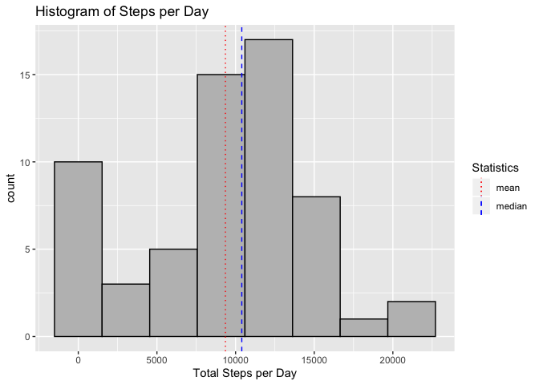
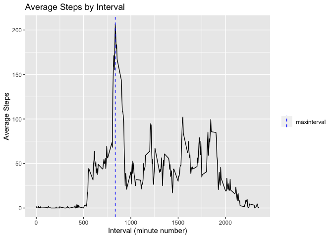
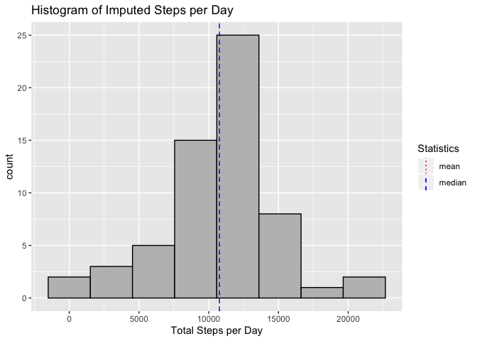
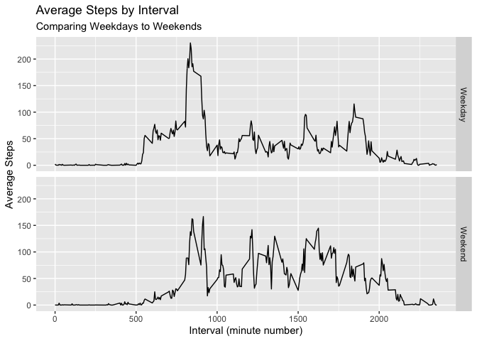

## Loading and preprocessing the data
Data is unzipped and loaded via read.csv(). Columns are cast into correct data types during the import.

```r
unzip("activity.zip")
activity <- read.csv("activity.csv", header = TRUE, colClasses = c("integer", "Date", "integer"))

# quick display of the loaded data
str(activity)
```

```
## 'data.frame':	17568 obs. of  3 variables:
##  $ steps   : int  NA NA NA NA NA NA NA NA NA NA ...
##  $ date    : Date, format: "2012-10-01" "2012-10-01" ...
##  $ interval: int  0 5 10 15 20 25 30 35 40 45 ...
```


## What is mean total number of steps taken per day?

1. Calculate the total number of steps taken by date.
1. Calculate the mean and the median statistics.
1. Plot a histogram of steps per day.


```r
# compute total steps taken for each date
steps_by_date <- activity %>%
    group_by(date) %>%
    summarise(total_steps = sum(steps, na.rm = TRUE))

# compute the mean and median across all days
mean_steps_per_day <- mean(steps_by_date$total_steps)
median_steps_per_day <- median(steps_by_date$total_steps)

# draw a histogram with mean and median annotated
ggplot(steps_by_date, aes(x = total_steps)) +
    geom_histogram(bins = 8, colour = 1, fill = "gray") + 
    geom_vline(mapping = aes(xintercept = mean_steps_per_day, color = "mean", linetype = "mean")) + 
    geom_vline(mapping = aes(xintercept = median_steps_per_day, color = "median", linetype = "median")) +
    scale_color_manual(name = "Statistics", values = c(median = "blue", mean = "red")) +
    scale_linetype_manual(name = "Statistics", values =c(median = "dashed", mean = "dotted")) + 
    labs(title = "Histogram of Steps per Day", x = "Total Steps per Day")
```

<!-- -->

The mean total number of steps taken per day is 9354.2 steps.  
The median total number of steps taken per day is 10395.0 steps.

## What is the average daily activity pattern?
1. Compute the average steps for each 5 minute interval.
2. Plot them on a line graph.


```r
# get the mean for each interval across all days
average_steps_by_interval <- activity %>%
    group_by(interval) %>%
    summarize(avg_steps = mean(steps, na.rm = TRUE))

# find the index of the maximum average steps
max_index <- which.max(average_steps_by_interval$avg_steps)

# plot a line chart illustrating average steps taken for each time period
ggplot(average_steps_by_interval, mapping = aes(x = interval, y = avg_steps)) + 
    geom_line() +
    geom_vline(mapping = aes(xintercept = average_steps_by_interval$interval[max_index], color = "maxinterval"), linetype = "dashed") +
    scale_color_manual(name = "", values = c(maxinterval = "blue")) +
    labs(title = "Average Steps by Interval", x = "Interval (minute number)", y = "Average Steps")
```

<!-- -->

Interval #835 has the highest average at 206.2 steps.

## Imputing missing values

1. Calculate and report the total number of missing values in the dataset  
    
    Get a summary of the dataset to see which field have NAs.
    
    ```r
    summary(activity)
    ```
    
    ```
    ##      steps             date               interval     
    ##  Min.   :  0.00   Min.   :2012-10-01   Min.   :   0.0  
    ##  1st Qu.:  0.00   1st Qu.:2012-10-16   1st Qu.: 588.8  
    ##  Median :  0.00   Median :2012-10-31   Median :1177.5  
    ##  Mean   : 37.38   Mean   :2012-10-31   Mean   :1177.5  
    ##  3rd Qu.: 12.00   3rd Qu.:2012-11-15   3rd Qu.:1766.2  
    ##  Max.   :806.00   Max.   :2012-11-30   Max.   :2355.0  
    ##  NA's   :2304
    ```
    
    2304 rows of data have missing values for the *steps* field.
    This represents 13.1% of the data
    is missing values.

1. Devise a strategy for filling in all of the missing values in the dataset.

    To impute the missing *steps* data, we will substitute the mean steps across all days for the corresponding
    5-minute interval.

1. Create a new dataset that is equal to the original dataset but with the missing data filled in.
    
    
    ```r
    # for each step with an NA value, mutate it to the avg_steps value from the average_steps_by_interval
    # dataframe we computed earlier.
    imputed_activity <- activity %>%
        mutate(steps = ifelse(is.na(steps), 
                              subset(average_steps_by_interval, 
                                     average_steps_by_interval$interval == interval)$avg_steps, 
                              steps))
    
    # show another summary for comparison
    summary(imputed_activity)
    ```
    
    ```
    ##      steps             date               interval     
    ##  Min.   :  0.00   Min.   :2012-10-01   Min.   :   0.0  
    ##  1st Qu.:  0.00   1st Qu.:2012-10-16   1st Qu.: 588.8  
    ##  Median :  0.00   Median :2012-10-31   Median :1177.5  
    ##  Mean   : 37.38   Mean   :2012-10-31   Mean   :1177.5  
    ##  3rd Qu.: 27.00   3rd Qu.:2012-11-15   3rd Qu.:1766.2  
    ##  Max.   :806.00   Max.   :2012-11-30   Max.   :2355.0
    ```

1. Make a histogram of the total number of steps taken each day and Calculate and report the mean and median total number of steps taken per day. Do these values differ from the estimates from the first part of the assignment? What is the impact of imputing missing data on the estimates of the total daily number of steps?

    
    ```r
    # compute total steps taken for each date
    imputed_steps_by_date <- imputed_activity %>%
        group_by(date) %>%
        summarise(total_steps = sum(steps, na.rm = TRUE))
    
    # compute the mean and median across all days
    imputed_mean_steps_per_day <- mean(imputed_steps_by_date$total_steps)
    imputed_median_steps_per_day <- median(imputed_steps_by_date$total_steps)
    
    # draw a histogram with mean and median annotated
    ggplot(imputed_steps_by_date, aes(x = total_steps)) +
        geom_histogram(bins = 8, colour = 1, fill = "gray") + 
        geom_vline(mapping = aes(xintercept = imputed_mean_steps_per_day, color = "mean", linetype = "mean")) + 
        geom_vline(mapping = aes(xintercept = imputed_median_steps_per_day, color = "median", linetype = "median")) +
        scale_color_manual(name = "Statistics", values = c(median = "blue", mean = "red")) +
        scale_linetype_manual(name = "Statistics", values =c(median = "dashed", mean = "dotted")) + 
        labs(title = "Histogram of Imputed Steps per Day", x = "Total Steps per Day")
    ```
    
    <!-- -->
    
    Let's compare the two sets of medians and means.  
    The per day steps statistics for when NAs are removed from the dataset:
    
    ```r
    summary(steps_by_date$total_steps)
    ```
    
    ```
    ##    Min. 1st Qu.  Median    Mean 3rd Qu.    Max. 
    ##       0    6778   10395    9354   12811   21194
    ```
    
    The per day steps statistics for when NAs are imputed:
    
    ```r
    summary(imputed_steps_by_date$total_steps)
    ```
    
    ```
    ##    Min. 1st Qu.  Median    Mean 3rd Qu.    Max. 
    ##      41    9819   10766   10766   12811   21194
    ```
    
    As a result of this imputing strategy both the mean and median moved up, because we added more non-zero
    values across the board.
    
## Are there differences in activity patterns between weekdays and weekends?

1. Compute the day name for each date, and add a flag to indicate if it's a weekend.

    
    ```r
    imputed_activity_with_days <- imputed_activity %>% 
        mutate(weekday = weekdays(date), daytype = ifelse(weekday %in% c("Saturday", "Sunday"), 
                                                          "Weekend", "Weekday"))    
    ```
    
1. Calculate average steps for each interval and day type
    
    ```r
    # get the mean for each interval across all days
    imputed_average_steps_by_interval_weekend <- imputed_activity_with_days %>%
        group_by(interval, daytype) %>%
        summarize(avg_steps = mean(steps))
    ```
    
1. Plot weekends and weekdays on two stacked panels:
    
    ```r
    ggplot(imputed_average_steps_by_interval_weekend, mapping = aes(x = interval, y = avg_steps)) + 
        geom_line() +
        facet_grid(rows = vars(daytype)) +
        labs(title = "Average Steps by Interval", subtitle = "Comparing Weekdays to Weekends", x = "Interval (minute number)", y = "Average Steps")
    ```
    
    <!-- -->

Based on the chart above we observe that:  
1. Activity starts to pick up later in the day on weekends. Perhaps people are sleeping in.  
2. People are more active (taking more steps) during their awake times on weekends.  
3. The peak activity level is higher on weekdays. The peak occurs around the same time interval on weekends, but the average value is lower.  
